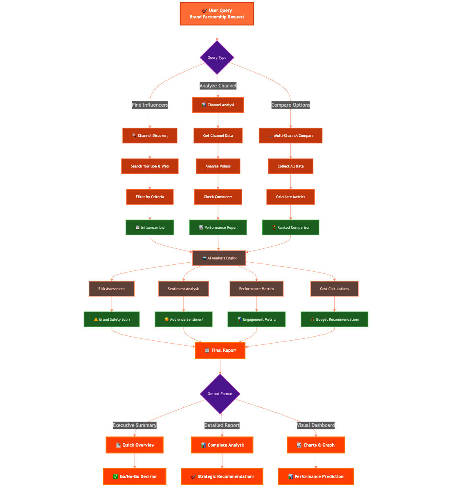
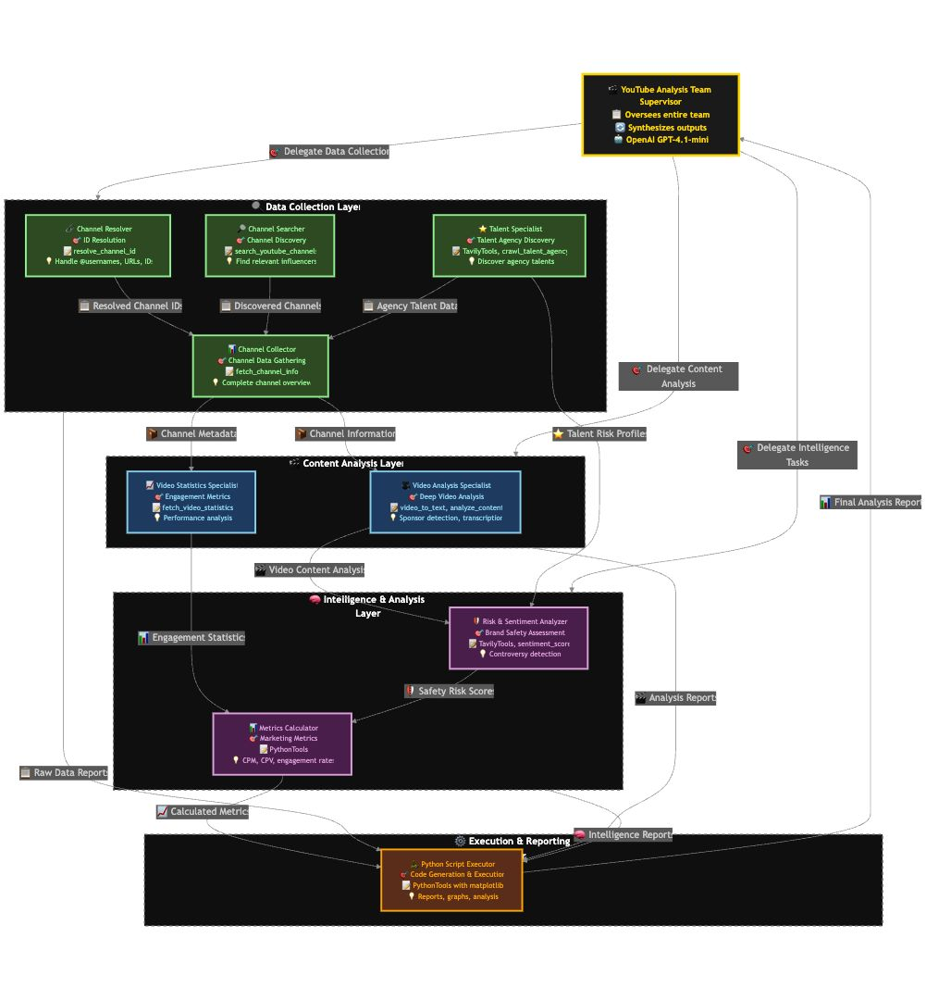

# Project Title
**BrandView AI – YouTube Influencer Intelligence Agent**

## Overview of the Idea
BrandView AI is a smart agent built with **Agno** that helps brands evaluate YouTube creators for influencer marketing. It analyzes channels and videos to help marketers find safe, high-performing influencers, faster and more accurately than doing manual research.

## Project Goal
To build an intelligent agent that allows brands to instantly:
1. Understand a creator’s audience and past performance  
2. Assess risk and sentiment around their content  
3. Analyze how they handle sponsorships  
4. Estimate ROI and CPM based on past metrics  
5. Discover and evaluate new talent by crawling talent agency websites  

## How It Works
Marketers interact with BrandView AI using simple chat prompts. Behind the scenes, the system (a coordinated team of specialized sub-agents) fetches YouTube data, processes it using Python-based tools, and delivers clear, actionable results. For complex calculations, a dedicated Python coder agent writes and executes code on the fly.

Each request can trigger a workflow involving:
- Resolving channel identifiers  
- Collecting channel and video data  
- Transcribing video audio to text  
- Analyzing video content for sponsor segments  
- Conducting risk and sentiment analysis  
- Running Python scripts for metric calculations  
- Crawling influencer talent agency websites to discover new collaborators  

All of this happens transparently within a single conversational interface.

### Example User Journeys:

🧠 User: “What is the maximum price we should pay @GamerINF to keep CPM under $30?”  
💬 Agent:  
- Resolves the channel ID for @GamerINF and fetches their last 10 videos.  
- Runs a Python script to calculate average views and determine the highest price for a target CPM.  
- Response: _“Offer no more than $5,700 to maintain a CPM below $30, based on average views of 190K.”_

🧠 User: “Show me which brands worked with @BeautyGuru over the last year.”  
💬 Agent:  
- Collects video metadata and comments for @BeautyGuru’s channel.  
- Searches for sponsorship-related keywords in titles, descriptions, transcripts, and visual cues.  
- Response: _“Detected partnerships with L'Oréal, Sephora, and Glossier in 7 videos.”_

🧠 User: “Discover new influencers in the gaming niche.”  
💬 Agent:  
- Uses Firecrawl to crawl known influencer agency websites.  
- Extracts talent information (name, social links, niche categories, basic stats).  
- Response:  
  1. **Found Agencies**: List of relevant gaming talent agencies and their websites.  
  2. **Talent Analysis**: For each agency, extracted talent names, niches, and social profiles.  
  3. **Summary**: _“Found 5 agencies and 27 gaming influencers, with top niches: “Let’s Plays,” “Speedruns,” and “Game Reviews.””_

## How It All Happens Behind the Scenes

- Individual specialized sub-agents (e.g., Channel ID Resolver, Channel Data Collector, Video Analysis Specialist, Risk & Sentiment Analyzer, Python Script Executor, Metrics Calculator, Video Statistics Specialist, Talent Specialist) coordinate under a central team orchestration to handle each task in parallel when needed.
- The Python coder agent (Python Script Executor) writes and runs code for any metric calculations or report generation.
- Firecrawl is used strictly to crawl influencer management agency websites for talent discovery—not for scraping scandal or controversy content.
- Video audio is transcribed on demand (audio→text) for deeper analysis of transcripts.
- Video content analysis (scene parsing and sponsor detection) is performed via the `analyze_video_content` tool.
- Risk and sentiment insights are drawn from comments and online searches using the `sentiment_score` tool and web search tools.  

### Agents in the Codebase
- **Channel ID Resolver**: Resolves various YouTube channel identifiers to official channel IDs.  
- **Channel Data Collector**: Gathers channel information, recent videos, and overall channel statistics.  
- **Video Analysis Specialist**: Retrieves video metadata, fetches comments, transcribes audio, and finds sponsor segments.  
- **Channel Search Specialist**: Discovers YouTube channels based on search queries.  
- **Risk & Sentiment Analyzer**: Evaluates brand-safety risks and sentiment from comments and online sources.  
- **Python Script Executor**: Generates and executes Python scripts for any requested calculations, graphs, or reports.  
- **Metrics Calculator**: Calculates influencer marketing metrics (CPM, CPV, CPA, engagement rate) using provided data.  
- **Video Statistics Specialist**: Analyzes engagement statistics (views, likes, comments) for recent videos.  
- **Talent Specialist**: Crawls influencer talent agency websites to extract talent profiles for collaborations.  

## Core Functionality
- **Channel Health Snapshot**  
  - Growth and engagement metrics (views, subscribers)  
  - Aggregate sentiment from recent comments  
- **Brand-Safety & Sentiment Analysis**  
  - Risk scan (flag profanity, controversial topics)  
  - Aggregate sentiment scoring for videos and comments  
- **Sponsor Segment Locator**  
  - Identify sponsor mentions and timestamps in videos  
  - Highlight retention drop-off around sponsored segments  
- **ROI & CPM Estimator**  
  - Calculate CPM, CPV, and CPA based on historical data using Python scripts  
  - Answer “What CPM do we hit if we pay $X?”  
- **Competitive Benchmarking**  
  - Compare two or more channels on views, engagement, and brand-safety metrics  
- **Talent Discovery & Analysis**  
  - Crawl influencer agency websites to find new talent  
  - Extract basic info: name, social links, niche, and any available stats  

## Multimodal Elements
- **Text**: Chat interface, transcripts, and analysis summaries  
- **Audio→Text**: Transcription of video audio when requested  
- **Video Analysis**: Scene parsing and sponsor detection via `analyze_video_content`  

## Tools Used
| **Purpose**                  | **Tool / Library**                                                                                           |
|------------------------------|---------------------------------------------------------------------------------------------------------------|
| Agent Orchestration          |  **Agno** |
| Backend & API                | **Python**, **FastAPI**                                                                                       |
| Chat LLM                     | **OpenAI GPT-4.1-mini**                                                                                       |
| Data Ingestion               | **YouTube Data API**, **yt-dlp**,  **Firecrawl** (crawl talent agency websites) |
| Audio to Text                | **video_to_text**                                                                                             |
| Video Analysis               | **analyze_video_content**                                                                                     |
| Sentiment Analysis           | **sentiment_score**                                                                                           |
| Python Execution & Reporting | **PythonTools** (via Python Script Executor agent)                                                             |
| Frontend (Demo)              | **Streamlit**                                                                                                 |
| Memory Layer                 |  **Mem0** (store short-term chat session memory) |

## UI Approach
- **Primary Interface**: Streamlit web app where users can start multiple chat sessions to interact with BrandView AI.  
- **Secondary Interface**: WhatsApp integration for on-the-go influencer queries via the Twilio webhook.

## Visuals
  
  

## Demo Video Link
[Watch the Demo](videos/demo.mp4)

## Team Information
- **Team Lead**: @mmestrov2000
- **Team Members**: @Abhishek637Saraswat, @LukaMestrovic
- **Background/Experience**: Marin Mestrovic has a Bachelor's degree in Mathematics with strong skills in algorithms, data science, and machine learning. Abhishek Saraswat is a B.Tech student in Electronics Engineering with experience in AI, machine learning, backend development, and projects in stock analysis and speech recognition. Luka Mestrovic has a background in physics, statistics, and mathematics, combined with industry-specific insights in influencer marketing.

## Prize Category (leave blank, to be assigned by judges)
- [ ] Best use of Agno
- [ ] Best use of Firecrawl
- [ ] Best use of Mem0
- [ ] Best use of Graphlit
- [ ] Best use of Browser Use
- [ ] Best Overall Project

## Additional Notes
- **Agent Collaboration**: Although BrandView AI appears as a single chat agent, it is powered by a coordinated team of specialized sub-agents, each with its own focus (data collection, analysis, Python scripting, talent discovery).  
- **Python-Driven Calculations**: Any complex metric calculation or report generation is handled by the Python Script Executor agent, ensuring accuracy and reproducibility.  
- **Firecrawl Usage**: Firecrawl is used exclusively to crawl official influencer agency websites for talent information—not for controversy scraping.  
- **Streamlit & WhatsApp Integration**: The Streamlit interface serves as the primary demo platform, while the WhatsApp integration allows users to query the agent from their mobile devices.  
- **Extensibility**: The modular architecture makes it straightforward to add new platforms (e.g., TikTok, Twitch) or additional analysis tools in the future.
